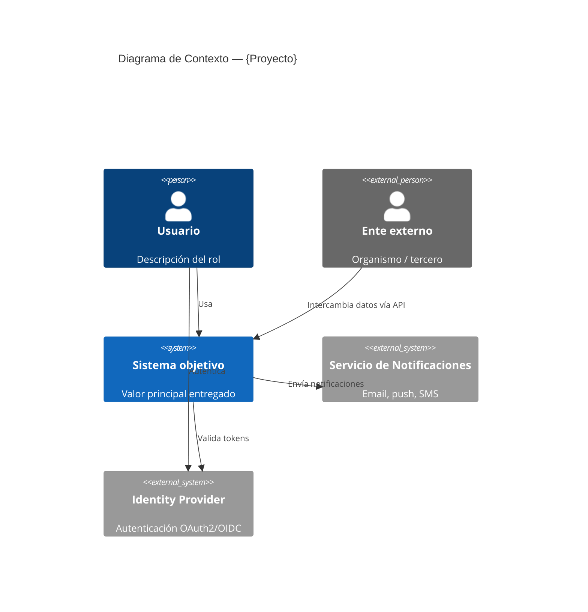
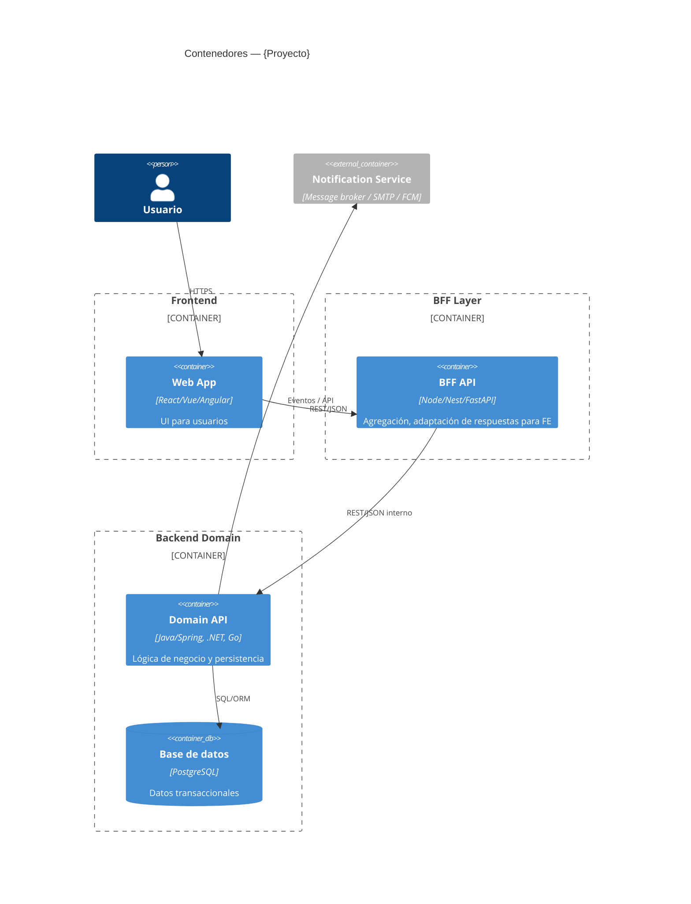
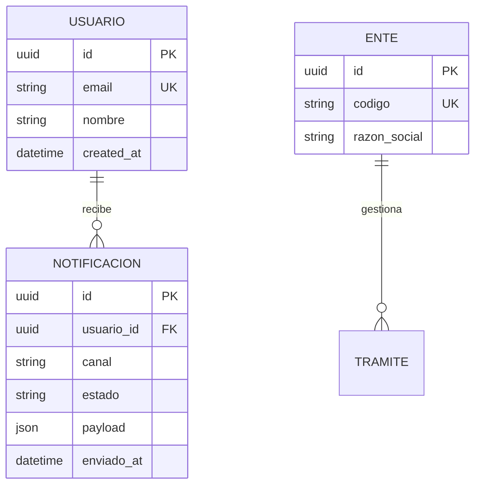
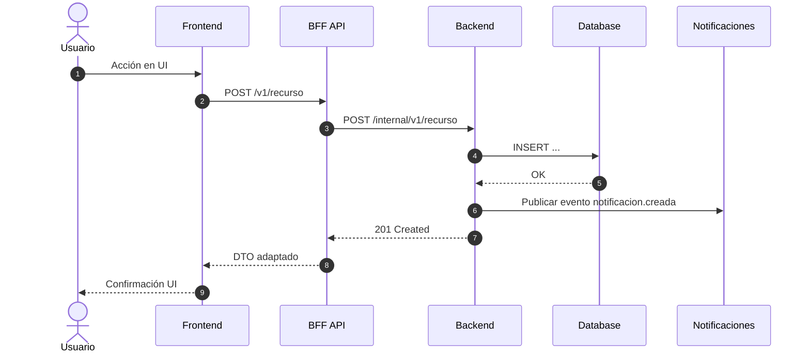
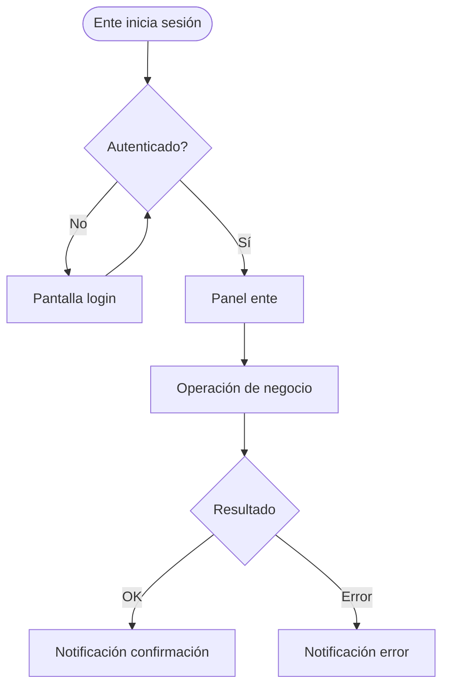
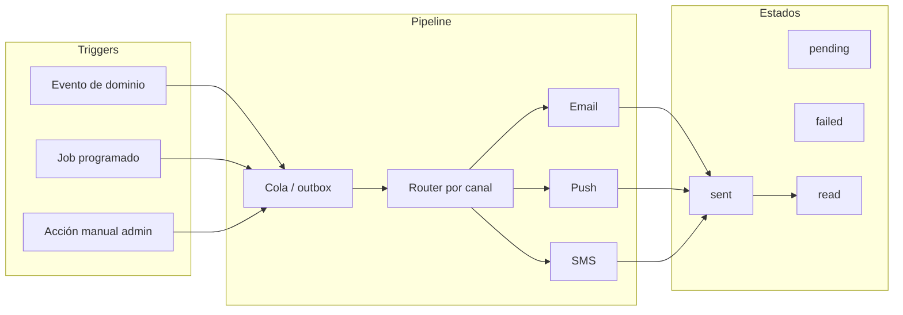

# Referencia — plantillas Mermaid y convenciones

## Convenciones de nomenclatura

| Elemento | Convención | Ejemplo |
|----------|------------|---------|
| Contenedores C4 | FE, BFF, BE, DB, EXT | `BFF_Notificaciones` |
| Entidades ER | PascalCase singular | `Usuario`, `Notificacion` |
| Endpoints REST | `/v1/{recurso-plural}` | `GET /v1/notificaciones` |
| Actores flujo | emoji + nombre | `👤 Usuario`, `🏢 Ente`, `🔔 Sistema Notificaciones` |

## 01 — C4 Context (contexto)



## 02 — C4 Container (FE / BFF / BE separados)



## 03–05 — Componentes por capa

Usar `flowchart TB` o `C4Component` según complejidad. Un diagrama por capa:

- **FE**: páginas, stores, servicios HTTP hacia BFF
- **BFF**: controllers, DTO mappers, clients hacia BE
- **BE**: controllers REST, services, repositories, entities

## 06 — Modelo ER (base de datos)



Reglas:
- PK/FK explícitos; tipos alineados al motor (PostgreSQL por defecto)
- Tablas en MAYÚSCULAS en diagrama; nombres físicos en snake_case en `07-database-schema.sql` si se genera

## 07 — Diagrama de secuencia



Un `.mmd` por flujo principal identificado en las historias (happy path + variantes críticas).

## 08 — User flow — Entes



## 09 — User flow — Usuarios

Misma estructura; actores y pantallas según historias. Incluir ramas de permisos/roles.

## 10 — User flow — Notificaciones



## REST API — plantilla OpenAPI (markdown)

Por cada recurso:

```markdown
### GET /v1/{recurso}
- **Historia:** HU-XX.01
- **Descripción:** ...
- **Auth:** Bearer JWT
- **Query:** page, size, filter
- **Response 200:** `{ "data": [...], "meta": { "total": N } }`
- **Errores:** 401, 403, 404

### POST /v1/{recurso}
- **Body:** `{ ... }`
- **Response 201:** `{ "id": "uuid", ... }`
- **Errores:** 400, 409, 422
```

BFF expone contratos orientados a pantallas; BE expone contratos de dominio. Documentar mapeo BFF→BE cuando difieran.

## Checklist de calidad

- [ ] Cada endpoint referencia al menos una HU
- [ ] FE no llama directamente a BE (siempre vía BFF salvo excepción documentada)
- [ ] Entidades ER cubren sustantivos del dominio en las historias
- [ ] Flujos de notificación cubren trigger, canal, estado y reintentos
- [ ] Todos los `.mmd` tienen `.png` correspondiente
- [ ] IDs Mermaid sin espacios ni caracteres especiales (usar `_`)

## Plantilla README.md de la carpeta de salida

```markdown
# Arquitectura — {título}

| Campo | Valor |
|-------|--------|
| **Fecha** | {YYYY-MM-DD} |
| **Historias Jira** | PROJ-101, PROJ-102 |
| **Generado con** | skill `jira-stories-to-architecture` |

## Artefactos

| Archivo | Descripción |
|---------|-------------|
| [00-summary.md](./00-summary.md) | Síntesis y decisiones |
| [01-c4-context.mmd](./01-c4-context.mmd) / [.png](./01-c4-context.png) | Contexto C4 |
| ... | ... |

## Cómo regenerar PNG

\`\`\`bash
python AI-Agents/jira-stories-to-architecture/scripts/render_mermaid.py .
\`\`\`
```

(Ejecutar el comando desde la carpeta de salida, o pasar la ruta a esa carpeta.)
